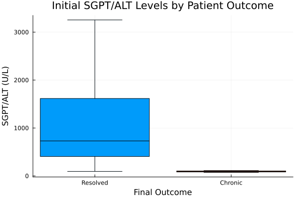
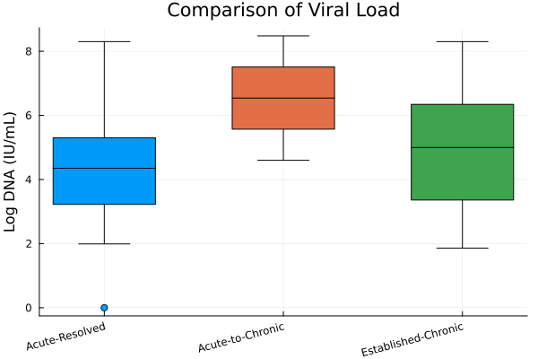

# A Data-Driven Framework for Predicting Chronic Hepatitis B through Feature Prioritization from a Sparse Clinical Dataset


## Overview

This repository contains the complete code and analysis for a study aimed at predicting the progression from acute to chronic Hepatitis B (AHB). The project addresses the common clinical informatics challenge of working with a high-dimensional dataset from a limited patient cohort.

The core of this work is an end-to-end machine learning pipeline developed in Julia. This pipeline processes raw, complex clinical data, trains a state-of-the-art XGBoost model, and extracts interpretable results to identify the most significant biomarkers for predicting disease outcome. The model's validity is demonstrated by its high predictive accuracy and its independent rediscovery of biomarkers known to be clinically relevant to liver function and disease progression.

### Key Features
*   **End-to-End Data Pipeline:** From raw CSVs to final publication-ready results and figures.
*   **Robust Data Cleaning:** A comprehensive workflow to handle missing data, inconsistent formatting, and complex column headers.
*   **Predictive Modeling:** Utilizes an XGBoost classifier, evaluated with rigorous Leave-One-Out Cross-Validation (LOOCV).
*   **Feature Importance Analysis:** Identifies and ranks the key clinical factors that are most predictive of the outcome.
*   **Exploratory Data Analysis (EDA):** Generates descriptive statistics and visualizations to characterize the patient cohort.
*   **Comparative Analysis:** Compares biomarkers across three distinct clinical states: Acute-Resolved, Acute-to-Chronic, and Established-Chronic.

## Key Results

The project successfully developed a predictive model and identified a core set of biomarkers.

### Model Performance
The XGBoost model achieved a **cross-validated accuracy of 90.9%** in predicting patient outcomes, demonstrating a strong predictive signal within the dataset.

### Predictive Biomarkers
Feature importance analysis identified six key predictors. The model's independent discovery of established liver function markers validates the robustness of the framework.

| Rank | Feature | Importance Score |
| :--- | :--- | :--- |
| **1** | `SGPT_ALT_AHB` | 2.26573 |
| **2**| `ARC_IgM_Core_S_Co__AHB`| 1.10977 |
| **3**| `TB_AHB` | 0.982959 |
| **4**| `Age_AHB` | 0.981654 |
| **5**| `Pre_S2_AHB` | 0.671907 |
| **6**| `PT_AHB` | 0.516444 |

*The full table is saved in `xgboost_important_features.csv`.*

## Visualizations

Below are examples of the exploratory and comparative plots generated by the analysis scripts.

| Initial ALT by Outcome | Viral Load Across Groups |
| :---: | :---: |
|  |  |

*(Note: Ensure the generated `.png` files are in the repository for these images to display.)*

## Getting Started

### Prerequisites
*   Julia (v1.6 or later)
*   The following data files in the root directory:
    *   `AHB_data.csv`
    *   `CHABE_data.csv`

### Installation & Setup

1.  **Clone the repository:**
    ```bash
    git clone [your-repository-url]
    cd [your-repository-name]
    ```
2.  **Launch Julia:**
    ```bash
    julia
    ```
3.  **Activate the project environment and install dependencies:**
    Inside the Julia REPL, press `]` to enter the package manager.
    ```julia
    (@v1.x) pkg> activate .
    (.) pkg> add DataFrames CSV Statistics MLJ CategoricalArrays ScientificTypes XGBoost Plots StatsPlots
    (.) pkg> # Press backspace to exit the package manager
    ```
    This will install all required packages based on the `Project.toml` and `Manifest.toml` files (if they are included in the repo).

## Usage

The analysis is divided into three main scripts. They should be run in the following order.

1.  **Main Predictive Analysis:**
    This script runs the core XGBoost model, evaluates its performance, and extracts the feature importances.
    ```bash
    julia analysis.jl
    ```
    *This will generate `xgboost_important_features.csv`.*

2.  **Exploratory Data Analysis (EDA):**
    This script generates the descriptive statistics and plots for the acute cohort.
    ```bash
    julia eda.jl
    ```
    *This will generate `descriptive_statistics.csv` and several `*.png` plots.*

3.  **Comparative Analysis:**
    This script combines the AHB and CHABE cohorts to produce comparative visualizations.
    ```bash
    julia comparative_analysis.jl
    ```
    *This will generate the `comparative_*.png` plots.*

## Project Structure
├── AHB_data.csv
├── CHABE_data.csv
├── analysis.jl
├── eda.jl
├── comparative_analysis.jl
├── README.md
├── Project.toml
├── Manifest.toml


## Citation
Manuscript in communication.

If you use this work, please cite the upcoming publication:
> *(Author(s)). (Year). "A Data-Driven Framework for Predicting Chronic Hepatitis B through Feature Prioritization from a Sparse Clinical Dataset". *

